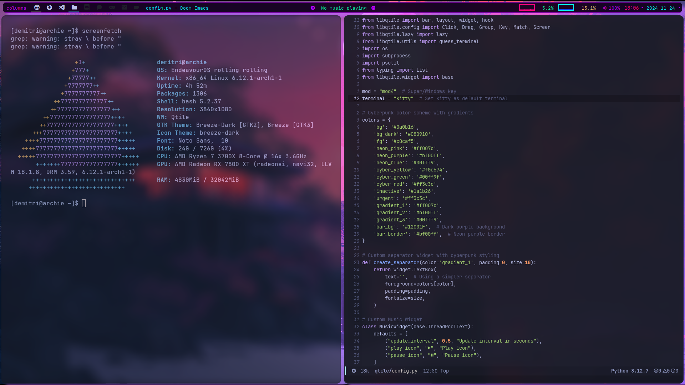

# 🏠 Dotfiles

## 👋 About Me
Hi, I'm Coofle! I am a Linux user who is passionate about open source and free software. I have been using Linux since 2020 and I am currently using Arch Linux. And Gentoo Linux for my daily use. These are my dotfiles. Thought I share them with the world. Because I hope someone will find them useful. and have Insperation to Learn from them as well.

### 🖥️ My Setup
- **OS**: Arch Linux 🎯
- **WM**: Qtile 🪟
- **Terminal**: Kitty 😺
- **Shell**: Zsh 🐚
- **Editor**: Emacs 📝
- **Compositor**: Picom ✨
- **Application Launcher**: Rofi 🚀
- **Notification Daemon**: Dunst 🔔
- **Wallpaper Manager**: Nitrogen 🖼️

## 📦 What's Inside
This repository contains my personal dotfiles for:
- Qtile window manager
- Picom compositor
- Rofi application launcher
- Dunst notification daemon
- Nitrogen wallpaper manager
- Collection of wallpapers

## 📸 Screenshot


## 🚀 Installation

1. Clone this repository:
```bash
git clone https://github.com/Coofle420/dotfiles.git
```

2. Create symbolic links:
```bash
# Create symbolic links for each config
ln -s ~/dotfiles/.config/qtile ~/.config/qtile
ln -s ~/dotfiles/.config/picom ~/.config/picom
ln -s ~/dotfiles/.config/rofi ~/.config/rofi
ln -s ~/dotfiles/.config/dunst ~/.config/dunst
ln -s ~/dotfiles/.config/nitrogen ~/.config/nitrogen
ln -s ~/dotfiles/.wallpapers ~/.wallpapers
